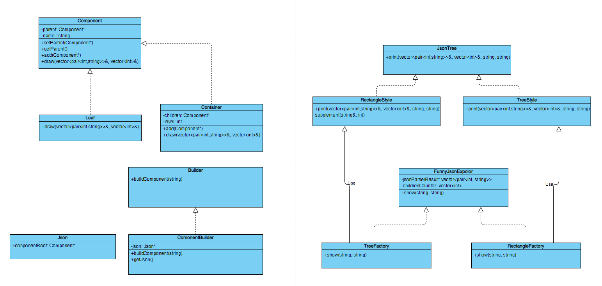

## Funny Json Explorer

### 编译

可以选择直接运行`compile.bat`来一键编译，也可以在执行以下命令来编译

```batch
g++ ./src/main.cpp ./src/CommonLibrary.h ./src/Component.h ./src/Component.cpp ./src/JsonTree.h ./src/JsonTree.cpp ./src/FunnyJsonExplorer.h ./src/FunnyJsonExplorer.cpp ./src/Builder.h ./src/Builder.cpp -o ./bin/fje
```

### 运行

编译完成后，可以前往`/bin`下执行以下指令运行程序

```batch
./fje -f <json file> -s <style> -i <icon family>
```

也可以将`.../bin`添加到环境变量中执行以下指令运行程序

```batch
fje -f <json file> -s <style> -i <icon family>
```

对于本程序，可行的指令格式样例如下

```batch
fje -f test.json -s tree
fje -f test.json -s tree -i ? $
```

本程序可以缺省图标族的参数，如果不指定图标族，那么本程序的输出结果将不包含图标，如果指定图标族，请输入两个要指定的图标，格式为`中间节点图标 叶节点图标` 

## 类图



### 设计说明

本程序采用了组合模式、建造者模式、抽象工厂模式、工厂模式，详细描述如下。

1. 组合模式
   
   使用组合模式用于将JSON数据表示为树状结构。其中实现了Component类提供基本的接口和变量，Container类和Leaf类均继承Component，Container类表示包含其他节点的节点，Leaf类表示叶子节点。

2. 建造者模式
   
   使用建造者模式利用JSON字符流构造组合模式的结构。实现Builder类提供基本接口，ComponentBuilder类继承Builder，调用Component构建JSON的树形结构。最后还实现了一个Json类用于表示构建结果。

3. 抽象工厂模式
   
   使用抽象工厂来统一图标族，实现了FunnyJsonExpolor作为抽象工厂，TreeFactory和RectangleFactory作为具体的工厂，TreeFactory和RectangleFactory调用并传入图标族给TreeStyle和RectangleStyle打印结果，实现对于任意风格，该风格都具有统一的图标族。用户可以直接调用该类来打印结果。

4. 工厂模式
   
   使用工厂模式来提供不同的打印风格，JsonTree工厂用于提供不同风格的对象，RectangleStyle和TreeStyle均继承JsonTree，RectangleStyle和TreeStyle表示两种不同的风格。

### 客户代码实现

整个程序的基本流程如下

- 读取json文件

- 使用builder构建json树形结构

- 调用FunnyJsonExplorer进行打印

可行的客户代码样例如下

```cpp
Builder *jsonComponent = new ComponentBuilder();  // 初始化Builder
jsonComponent->buildComponent(jsonStr);  // 使用Builder构建Json文件的组合模式树形结构
FunnyJsonExplorer *fje = new TreeFactory(jsonComponent->getJson()->componentRoot); // 选择打印风格
fje->show(icon1, icon2);  // 指定图标族并打印
```

用户调用Builder完成对json进行构造后，只需要调用FunnyJsonExplorer提供的接口即可完成打印。
